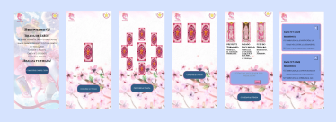

# sakura-Tarot

## Objetivos
El objetivo de este proyecto fue crear una aplicación que consuma la API de Sakura https://6388b6e5a4bb27a7f78f96a5.mockapi.io/sakura-cards/  la cual devuelve un archivo JSON con la información de las cartas. Para este ejercicio, elegí mostrar la "sakura card". La aplicación permité al usuario seleccionar una carta para el pasado, otra para el presente y otra para el futuro, y luego obtener el significado de cada carta seleccionada, pudiendo poner en esta lectura como se siente y esto poder guardarlo, para poder guardar y borrar estas lecturas se utilizo json server.

## Instalación y ejecución
Para instalar y ejecutar la aplicación, sigue estos pasos:

Clona el repositorio en tu máquina local.

https://github.com/mgblanco10/sakura-Tarot.git

Abre una terminal y navega hasta el directorio del proyecto.

Instala las dependencias del proyecto ejecutando el siguiente comando:

`npm install`

Inicia la aplicación ejecutando el siguiente comando:

`npm run dev`  

Para poder guardar y almacenar las lecturas se utiliza JSON Server. Para iniciar el servidor JSON, abre otra terminal en el directorio del proyecto y ejecuta el siguiente comando:

`npm run dev`

Esto iniciará el servidor JSON en http://localhost:3000.

Recuerda que es necesario tener Node.js y npm instalados en tu máquina para poder ejecutar la aplicación.

# Maqueta 
### Figma mobile

### Figma version desktop

